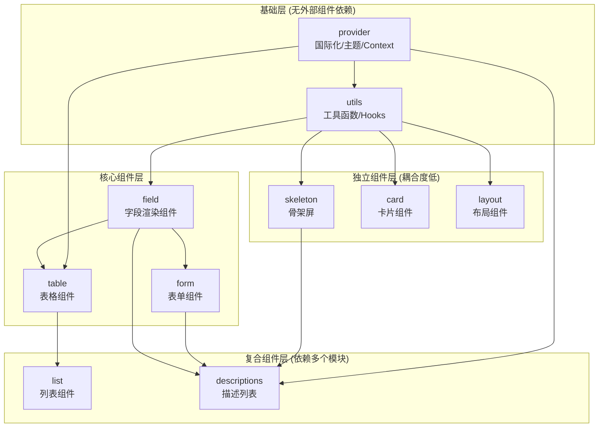

# Ant Design Pro Components 重构计划书

> 目标：基于 Ant Design Pro Components 的设计理念，使用 Vue3 + Element Plus 构建 plus-components 企业级组件库

---

## 一、项目架构总览

### 1.1 Pro Components 项目信息

| 属性 | 值 |
|------|-----|
| 包名 | `@ant-design/pro-components` |
| 版本 | 3.1.2-0 |
| 技术栈 | React 18 + Antd 6 + TypeScript |
| 构建工具 | father (基于 esbuild) |
| 测试框架 | Vitest |
| 文档工具 | dumi |

### 1.2 核心依赖分析

```
生产依赖：
├── @ant-design/cssinjs    - CSS-in-JS 样式方案
├── @ant-design/icons      - 图标库
├── @dnd-kit/*             - 拖拽功能
├── dayjs                  - 日期处理
├── swr                    - 数据请求缓存
├── clsx                   - 类名合并
└── lodash-es              - 工具函数

对应 Vue3 替代方案：
├── Element Plus           - 组件库 ✓
├── @element-plus/icons-vue - 图标库
├── VueUse                 - 组合式工具库
├── vue-draggable-plus     - 拖拽功能
├── dayjs                  - 日期处理（可复用）
└── @tanstack/vue-query    - 数据请求缓存
```

---

## 二、模块依赖层级分析

### 2.1 依赖关系图



### 2.2 模块详情

| 模块 | 子组件数 | 代码行数(入口) | 被引用次数 | 耦合度 | 重构优先级 |
|------|----------|----------------|------------|--------|------------|
| skeleton | 3 | 48 | 1 (descriptions) | ⭐ 极低 | 🥇 1 |
| card | 8 | 25 | 1 (list) | ⭐ 低 | 🥈 2 |
| layout | 14 | 69 | 0 | ⭐ 独立 | 🥉 3 |
| provider | 33语言包 | 485 | 5 | ⭐⭐ 中 | 4 |
| utils | 12 hooks + 7 组件 | 146 | 全部 | ⭐⭐⭐ 高 | 5 |
| field | 28 | 82 | 4 | ⭐⭐ 中 | 6 |
| form | 25+8布局 | 44 | 2 | ⭐⭐ 中 | 7 |
| table | 8 | 94 | 1 | ⭐⭐ 中 | 8 |
| list | 4 | 245 | 0 | ⭐⭐ 中 | 9 |
| descriptions | 2 | 653 | 0 | ⭐⭐⭐ 高 | 10 |

---

## 三、各模块详细分析

### 3.1 skeleton（骨架屏）⭐ 推荐首先重构

**原因**：
- 完全独立，仅被 `descriptions` 引用一次
- 纯UI组件，无复杂逻辑
- 代码量小，便于快速验证架构

**组件清单**：

```
skeleton/
├── index.tsx                    # 入口，统一导出
└── components/
    ├── Descriptions.tsx         # 描述骨架屏 + TableSkeleton
    ├── List.tsx                 # 列表骨架屏 + PageHeaderSkeleton
    └── Result.tsx               # 结果页骨架屏
```

**重构要点**：
1. 使用 Element Plus 的 `ElSkeleton` 组件作为基础
2. 保持 API 设计理念（type 属性切换不同样式）
3. 无需处理复杂状态管理

---

### 3.2 card（卡片组件）⭐ 推荐第二重构

**原因**：
- 低耦合，仅被 `list` 的 `itemCardProps` 引用
- 包含实用的业务组件（统计卡片、选择卡片）
- 可独立使用，验证价值高

**组件清单**：

```
card/
├── ProCard.tsx                  # 主卡片组件
├── typing.ts                    # 类型定义
└── components/
    ├── Card/                    # 基础卡片
    ├── Actions/                 # 卡片操作区
    ├── Divider/                 # 分割线
    ├── Loading/                 # 加载状态
    ├── Operation/               # 操作组件
    ├── CheckCard/               # 选择卡片（可选中）
    │   └── Group.tsx            # 选择卡片组
    ├── Statistic/               # 统计数值
    └── StatisticCard/           # 统计卡片（融合）
```

**重构要点**：
1. 基于 `ElCard` 扩展，添加 `collapsible`、`ghost`、`hoverable` 等特性
2. `CheckCard` 需实现选中态管理（单选/多选）
3. `StatisticCard` 可参考 Element Plus 的 `ElStatistic`

---

### 3.3 layout（布局组件）⭐ 推荐第三重构

**原因**：
- 完全独立，不被其他模块引用
- 适合作为项目整体框架
- 可单独发布使用

**组件清单**：

```
layout/
├── ProLayout.tsx               # 主布局（28KB，较复杂）
├── defaultSettings.ts          # 默认配置
├── getPageTitle.ts            # 页面标题
├── WrapContent.tsx            # 内容包装器
├── context/RouteContext.tsx   # 路由上下文
├── locales/                   # 11种语言包
└── components/
    ├── AppsLogoComponents/    # 应用Logo（多应用切换）
    ├── CollapsedIcon/         # 折叠图标
    ├── Footer/                # 页脚
    ├── FooterToolbar/         # 底部工具栏（固定）
    ├── GlobalFooter/          # 全局页脚
    ├── GlobalHeader/          # 全局头部
    ├── GridContent/           # 栅格内容
    ├── Header/                # 头部导航
    ├── Help/                  # 帮助组件（11个子组件）
    ├── PageContainer/         # 页面容器（含面包屑/页头）
    ├── PageHeader/            # 页头
    ├── PageLoading/           # 页面加载
    ├── SettingDrawer/         # 设置抽屉（主题/布局配置）
    ├── SiderMenu/             # 侧边菜单（7个子组件）
    └── TopNavHeader/          # 顶部导航
```

**重构要点**：
1. 使用 `ElContainer`/`ElAside`/`ElMain` 作为布局基础
2. 菜单需支持多种布局模式（side/top/mix）
3. `SettingDrawer` 实现主题实时切换
4. 路由集成需适配 Vue Router

---

### 3.4 provider（配置提供者）

**职责**：
- 国际化配置（33种语言）
- 主题 Token 管理
- 全局 Context 注入

**组件清单**：

```
provider/
├── index.tsx                   # ConfigProvider 封装
├── intl.ts                     # 国际化工具
├── locale/                     # 33种语言文件
├── typing/layoutToken.ts       # 主题Token类型
├── useStyle/                   # CSS-in-JS 工具
└── utils/merge.ts             # 配置合并
```

**重构要点**：
1. 使用 Vue 的 `provide/inject` 替代 React Context
2. 集成 `vue-i18n` 处理国际化
3. Element Plus 已有主题系统，可复用 CSS Variables
4. 简化 Token 设计，适配 Element Plus 设计规范

---

### 3.5 utils（工具层）

> ⚠️ **重要提示**：这是最核心的基础层，几乎被所有模块引用。虽然代码不复杂，但需要仔细设计 API，因为改动成本高。

**组件和Hooks清单**：

```
utils/
├── typing.ts                   # 核心类型定义（763行）
│                               # - ProSchema (列/表单项统一配置)
│                               # - ValueType (字段类型枚举)
│                               # - ProCoreActionType (操作API)
├── components/
│   ├── DropdownFooter/        # 下拉菜单页脚
│   ├── ErrorBoundary/         # 错误边界
│   ├── FieldLabel/            # 字段标签
│   ├── FilterDropdown/        # 筛选下拉
│   ├── InlineErrorFormItem/   # 行内错误表单项
│   ├── LabelIconTip/          # 标签+图标提示
│   └── ProFormContext/        # 表单上下文
├── hooks/
│   ├── useDebounceFn          # 防抖函数
│   ├── useDebounceValue       # 防抖值
│   ├── useDeepCompareEffect   # 深比较Effect
│   ├── useDeepCompareMemo     # 深比较Memo
│   ├── useDocumentTitle       # 页面标题
│   ├── useFetchData           # 数据请求
│   ├── useLatest              # 最新值引用
│   ├── usePrevious            # 上一个值
│   ├── useReactiveRef         # 响应式引用
│   ├── useRefCallback         # 回调引用
│   └── useRefFunction         # 函数引用
└── 独立工具函数/
    ├── conversionMomentValue  # 时间值转换
    ├── dateArrayFormatter     # 日期格式化
    ├── genCopyable           # 生成可复制文本
    ├── isUrl/isImg/isNil     # 类型判断
    ├── merge                 # 深合并
    ├── nanoid                # ID生成
    ├── omitUndefined         # 过滤空值
    ├── parseValueToMoment    # 解析为时间
    ├── pickProFormItemProps  # 提取表单项属性
    ├── proFieldParsingText   # 解析字段文本
    ├── runFunction           # 运行函数
    ├── stringify             # JSON序列化
    ├── transformKeySubmitValue # 转换提交值
    ├── useEditableArray      # 可编辑数组
    └── useEditableMap        # 可编辑Map
```

**重构要点**：
1. 大部分 Hooks 可用 VueUse 替代或简化实现
2. `typing.ts` 需重新设计，适配 Vue3 的响应式系统
3. 组件使用 `<script setup>` + 组合式 API 重写
4. `useEditableArray/Map` 是核心，需重点实现

---

### 3.6 field（字段渲染组件）

**职责**：
- 根据 `valueType` 渲染不同的字段组件
- 支持 `read`（只读）和 `edit`（编辑）两种模式
- 统一的数据格式化和解析

**28个字段组件**：

```
field/components/
├── Text/           # 文本
├── TextArea/       # 多行文本
├── Password/       # 密码
├── Digit/          # 数字
├── DigitRange/     # 数字范围
├── Money/          # 金额
├── Percent/        # 百分比
├── Rate/           # 评分
├── Slider/         # 滑动条
├── Switch/         # 开关
├── Select/         # 下拉选择
├── Radio/          # 单选
├── Checkbox/       # 多选
├── Cascader/       # 级联选择
├── TreeSelect/     # 树选择
├── DatePicker/     # 日期
├── RangePicker/    # 日期范围
├── TimePicker/     # 时间
├── FromNow/        # 相对时间
├── Second/         # 秒数
├── Progress/       # 进度条
├── Image/          # 图片
├── Code/           # 代码
├── ColorPicker/    # 颜色选择
├── Segmented/      # 分段器
├── Status/         # 状态标签
├── IndexColumn/    # 序号列
└── Options/        # 操作列
```

**核心架构**：

```
index.tsx          # 入口，导出所有组件
AllProField.tsx    # 统一渲染器，根据valueType分发
PureProField.tsx   # 纯渲染组件
ValueTypeToComponent.tsx  # valueType到组件的映射表
FieldHOC/          # 高阶组件包装
```

**重构要点**：
1. 每个字段组件都需适配 Element Plus 对应组件
2. 保持 `mode: read | edit` 双模式设计
3. 统一 `request` 属性处理异步数据
4. 建立 Vue 版本的组件映射表

---

### 3.7 form（表单组件）

**布局组件（8个）**：

```
form/layouts/
├── ProForm/        # 基础表单
├── QueryFilter/    # 查询筛选器
├── LightFilter/    # 轻量筛选器
├── StepsForm/      # 分步表单
├── ModalForm/      # 弹窗表单
├── DrawerForm/     # 抽屉表单
├── LoginForm/      # 登录表单
└── LoginFormPage/  # 登录页表单
```

**表单项组件（25个）**：

```
form/components/
├── Field/          # 通用字段
├── FormItem/       # 表单项包装
├── SchemaForm/     # Schema驱动表单（13个子组件）
├── List/           # 表单列表
├── FieldSet/       # 字段集
├── Dependency/     # 依赖联动
├── Text/           # 文本输入
├── TextArea/       # 多行文本
├── Digit/          # 数字输入
├── Select/         # 下拉选择
├── Radio/          # 单选
├── Checkbox/       # 多选
├── Switch/         # 开关
├── Rate/           # 评分
├── Slider/         # 滑动条
├── Money/          # 金额
├── Cascader/       # 级联
├── TreeSelect/     # 树选择
├── DatePicker/     # 日期（9个变体）
├── DateRangePicker/ # 日期范围（8个变体）
├── ColorPicker/    # 颜色
├── Captcha/        # 验证码
├── Segmented/      # 分段器
├── UploadButton/   # 上传按钮
└── UploadDragger/  # 拖拽上传
```

**重构要点**：
1. 基于 `ElForm` + `ElFormItem` 构建
2. 表单验证使用 Element Plus 自带的 async-validator
3. `SchemaForm` 需实现 JSON 配置驱动
4. 布局表单（Modal/Drawer）可使用 ElDialog/ElDrawer 封装

---

### 3.8 table（表格组件）

**组件清单**：

```
table/
├── Table.tsx           # 主表格（31KB，核心）
├── TableSearch.tsx     # 表格搜索
├── TableToolbar.tsx    # 表格工具栏
├── typing.ts           # 类型定义（16KB）
├── useFetchData.tsx    # 数据请求Hook
├── Store/              # 状态管理
├── utils/              # 表格工具函数
└── components/
    ├── Alert/          # 选中提示
    ├── ColumnSetting/  # 列设置
    ├── DragSortTable/  # 拖拽排序表格
    ├── Dropdown/       # 下拉菜单
    ├── EditableTable/  # 可编辑表格
    │   ├── CellEditorTable  # 单元格编辑
    │   └── RowEditorTable   # 行编辑
    ├── Form/           # 搜索表单
    ├── ListToolBar/    # 列表工具栏
    └── ToolBar/        # 工具栏
```

**重构要点**：
1. 基于 `ElTable` + `ElTableColumn` 构建
2. 可编辑表格是核心难点，需重点实现
3. 工具栏（列设置/密度/刷新/全屏）需适配
4. 虚拟滚动可考虑使用 `el-table-v2`

---

### 3.9 list（列表组件）

**组件清单**：

```
list/
├── index.tsx        # 主组件（245行）
├── ListView.tsx     # 列表视图
├── Item.tsx         # 列表项
├── constants.ts     # 常量
└── style/           # 样式
```

**重构要点**：
1. 基于 ProTable 封装，切换为列表视图
2. 复用 `metas` 配置方式（avatar/title/description/actions）
3. 支持卡片列表模式（使用 CheckCard）

---

### 3.10 descriptions（描述列表）

**组件清单**：

```
descriptions/
├── index.tsx        # 主组件（653行，最复杂）
└── useFetchData.tsx # 数据请求
```

**重构要点**：
1. 基于 `ElDescriptions` + `ElDescriptionsItem` 构建
2. 支持可编辑模式（行内编辑）
3. 集成 ProField 渲染不同类型
4. 支持 `request` 异步加载数据

---

## 四、重构优先级排序

> ⚠️ **重构原则**：**被引用最少 → 被引用最多**，减少重构过程中的连锁反应

### 推荐重构顺序

```
┌─────────────────────────────────────────────────────────────────┐
│  第1波（独立组件，可并行）                                        │
│  ┌──────────┐  ┌──────────┐  ┌──────────┐                       │
│  │ skeleton │  │   card   │  │  layout  │                       │
│  │  3天     │  │   5天    │  │   7天    │                       │
│  └──────────┘  └──────────┘  └──────────┘                       │
│        ↓                                                         │
├─────────────────────────────────────────────────────────────────┤
│  第2波（基础层）                                                  │
│  ┌──────────┐  ┌──────────┐                                     │
│  │ provider │→→│  utils   │                                     │
│  │  3天     │  │   5天    │                                     │
│  └──────────┘  └──────────┘                                     │
│        ↓            ↓                                           │
├─────────────────────────────────────────────────────────────────┤
│  第3波（核心组件）                                                │
│  ┌──────────┐                                                   │
│  │  field   │                                                   │
│  │  10天    │                                                   │
│  └──────────┘                                                   │
│        ↓                                                         │
│  ┌──────────┐  ┌──────────┐                                     │
│  │   form   │  │  table   │  （可并行）                          │
│  │  10天    │  │  12天    │                                     │
│  └──────────┘  └──────────┘                                     │
│        ↓            ↓                                           │
├─────────────────────────────────────────────────────────────────┤
│  第4波（复合组件）                                                │
│  ┌──────────┐  ┌─────────────┐                                  │
│  │   list   │  │ descriptions│                                  │
│  │   3天    │  │     5天     │                                  │
│  └──────────┘  └─────────────┘                                  │
└─────────────────────────────────────────────────────────────────┘
                预估总工期：约 50-60 人天
```

---

## 五、技术方案对照

| React Pro Components | Vue3 Plus Components |
|---------------------|----------------------|
| React 18 | Vue 3.4+ |
| Antd 6 | Element Plus 2.x |
| CSS-in-JS (@ant-design/cssinjs) | CSS Variables + SCSS |
| React Context | provide/inject |
| SWR | @tanstack/vue-query |
| @dnd-kit | vue-draggable-plus |
| dayjs | dayjs (保持) |
| React Router | Vue Router 4 |

---

## 六、验证计划

### 6.1 单元测试
- 使用 Vitest 作为测试框架（与原项目一致）
- 每个组件需有基础渲染测试
- 关键逻辑需有单元测试覆盖

### 6.2 组件演示
- 使用 VitePress 构建文档站点
- 每个组件提供在线 Demo

### 6.3 验收标准
1. **skeleton**: 能渲染列表/描述/结果三种骨架屏
2. **card**: ProCard 支持折叠/选择/统计卡片
3. **layout**: 实现侧边栏/顶部/混合三种布局模式
4. **field**: 28 种字段类型均可正常渲染
5. **form**: SchemaForm 可通过 JSON 配置生成表单
6. **table**: 可编辑表格功能完整

---

## 七、附录：模块代码量统计

| 模块 | 文件数 | 大小(约) |
|------|--------|----------|
| skeleton | 4 | ~5KB |
| card | 17 | ~15KB |
| layout | 59 | ~60KB |
| provider | 38 | ~20KB |
| utils | 55 | ~60KB |
| field | 37 | ~50KB |
| form | 89 | ~70KB |
| table | 33 | ~90KB |
| list | 5 | ~30KB |
| descriptions | 2 | ~22KB |
| **合计** | **~370** | **~420KB** |

---

> 本计划基于对 `@ant-design/pro-components@3.1.2-0` 源码的完整分析生成
> 
> 生成时间：2026-02-02
